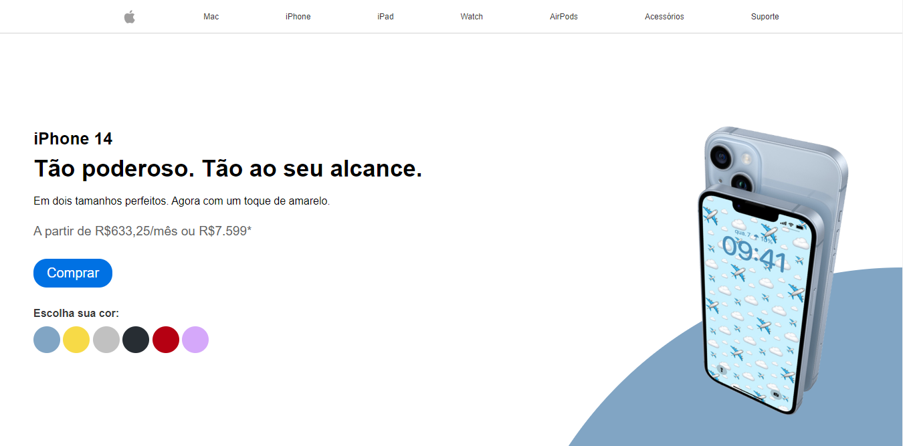

# iPhone Store

Projeto desenvolvido em HTML,CSS e Java Script na semana Você Programador do Rodolfo Mori. O site desenvolvido é dinâmico, permitindo que ao escolher a cor do iPhone a imagem também mude.

🔗 [Click here to access](https://n4ju15.github.io/iphone_store/)

## Versão para Desktop

## Versão para Mobile

## Tecnologias

- HTML
- CSS
- Java Script
- Git and Github
